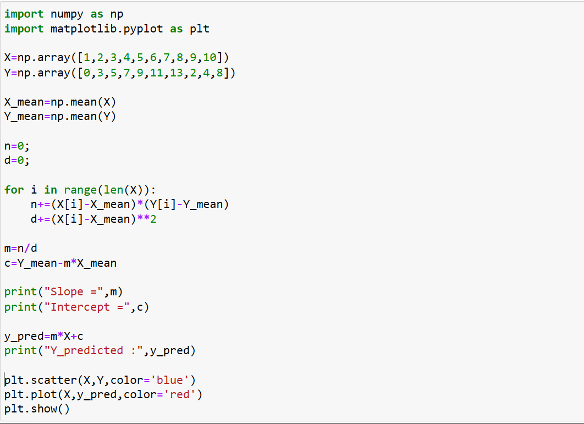
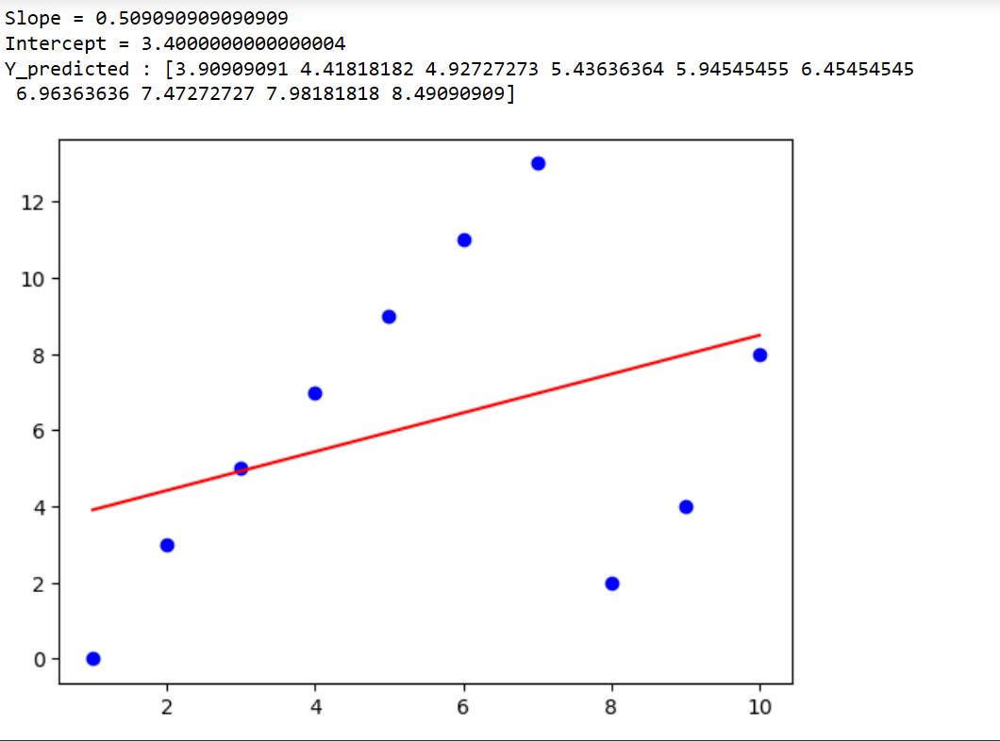

# Implementation of Univariate Linear Regression
## AIM:
To implement univariate Linear Regression to fit a straight line using least squares.

## Equipments Required:
1. Hardware – PCs
2. Anaconda – Python 3.7 Installation / Jupyter notebook

## Algorithm
1. Get the independent variable X and dependent variable Y.
2. Calculate the mean of the X -values and the mean of the Y -values.
3. Find the slope m of the line of best fit using the formula. 

4. Compute the y -intercept of the line by using the formula:

5. Use the slope m and the y -intercept to form the equation of the line.
6. Obtain the straight line equation Y=mX+b and plot the scatterplot.

## Program:
```
/*
Program to implement univariate Linear Regression to fit a straight line using least squares.

import numpy as np
import matplotlib.pyplot as plt

X=np.array([1,2,3,4,5,6,7,8,9,10])
Y=np.array([0,3,5,7,9,11,13,2,4,8])

X_mean=np.mean(X)
Y_mean=np.mean(Y)

n=0;
d=0;

for i in range(len(X)):
    n+=(X[i]-X_mean)*(Y[i]-Y_mean)
    d+=(X[i]-X_mean)**2
    
m=n/d
c=Y_mean-m*X_mean

print("Slope =",m)
print("Intercept =",c)

y_pred=m*X+c
print("Y_predicted :",y_pred)

plt.scatter(X,Y,color='blue')
plt.plot(X,y_pred,color='red')
plt.show()

Developed by: Swathi P N
RegisterNumber:  212225230279
*/
```

## Output:





## Result:
Thus the univariate Linear Regression was implemented to fit a straight line using least squares using python programming.
